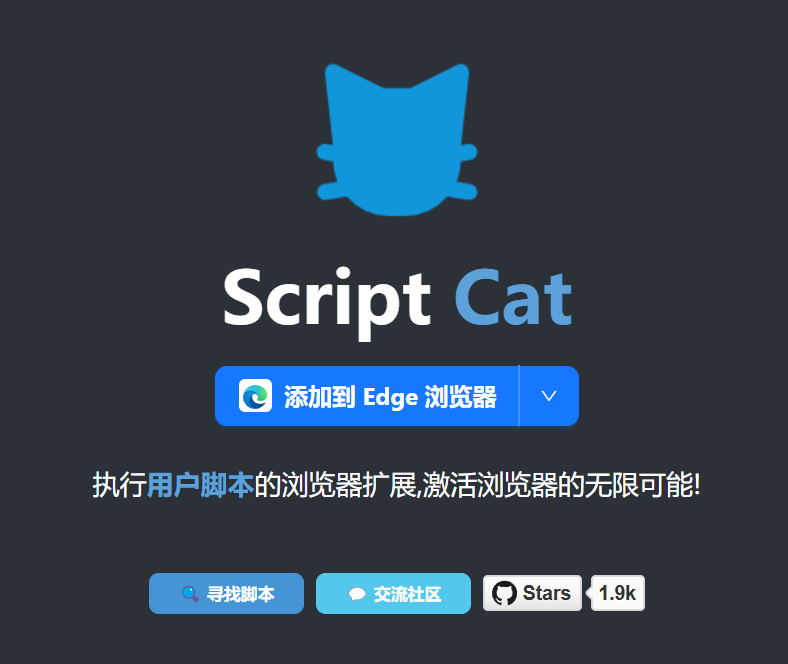
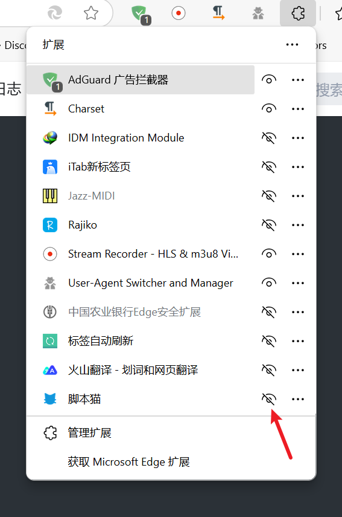
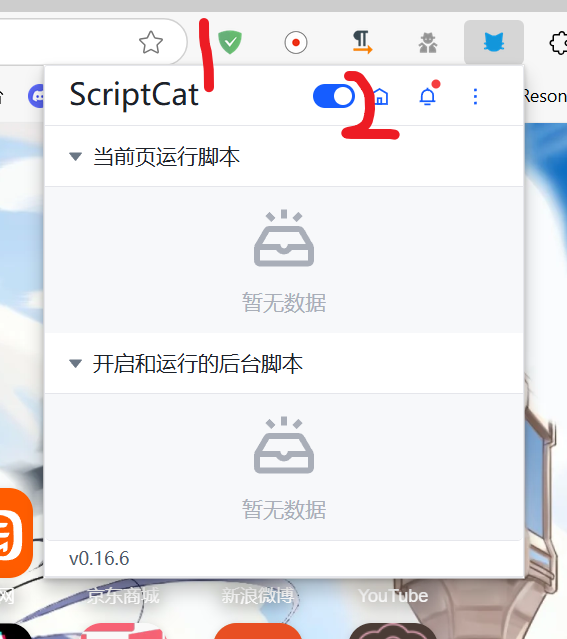
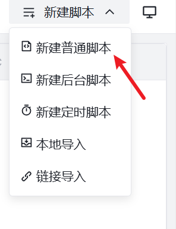
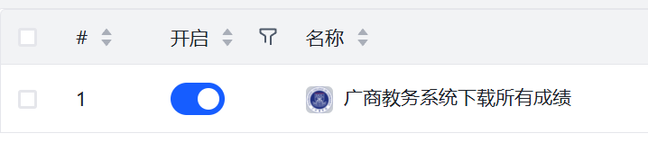
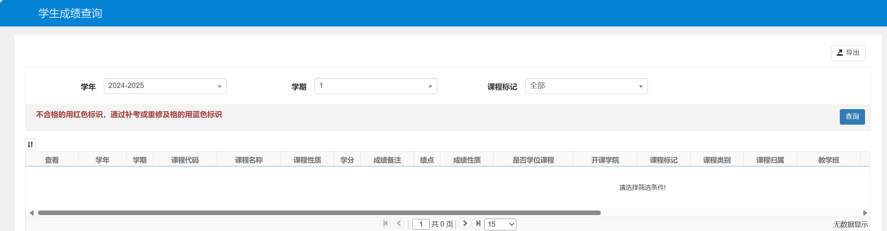
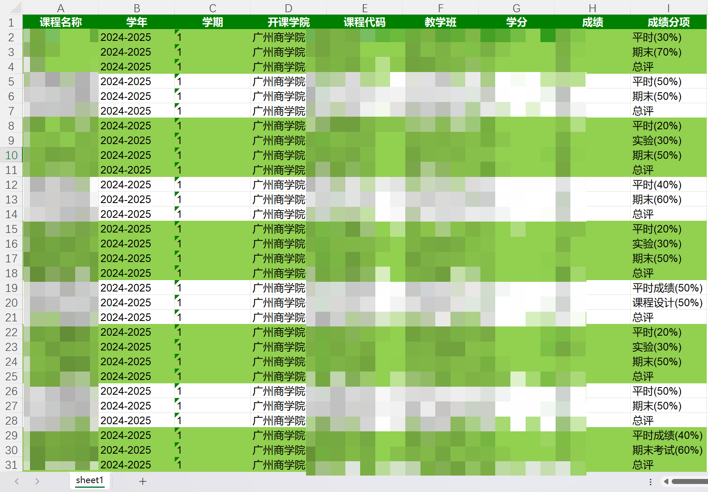
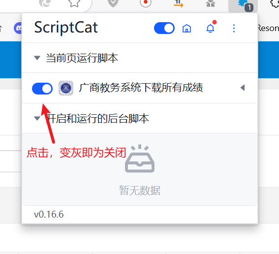

## 查成绩进阶技巧

打开系统自带的edge浏览器。

参考这里的文档安装脚本猫插件，点击添加到浏览器的按钮：[首页 | ScriptCat](https://docs.scriptcat.org/)






点击插件图标，再点击小眼睛按钮，让其固定在上面。

[GitHub安装]（推荐有梯子）(https://raw.githubusercontent.com/404undefined/gcc-cjcx/master/gcc_score.user.js)


没有梯子跟着接下来的步骤

点击图标，再点击“家”按钮。



在打开的页面右上角，选择新建脚本——新建普通脚本



**注意，以下代码并非我原创：**

是从各路大佬的代码中各种二开出来，符合我们学校的教务成绩查询系统

全选内容清除，将下列内容贴入：

```javascript
// ==UserScript==
// @name         广商教务系统下载所有成绩
// @namespace    http://tampermonkey.net/
// @version      0.1
// @description  try to take over the world!
// @author       404_undefined
// @match        https://jwxt.gcc.edu.cn/cjcx/cjcx_cxDgXscj.html?gnmkdm=N305005&layout=default
// @icon         https://www.gcc.edu.cn/favicon.ico
// @grant        none
// @require      https://code.jquery.com/jquery-3.6.0.min.js
// ==/UserScript==

(function() {
    'use strict';

    // 创建按钮元素
    let ele = $("<button type='button' class='btn btn-default btn_dc' href='javascript:void(0);'><i class='bigger-100 glyphicon glyphicon-export'></i> 导出所有成绩</button>");

    // 按钮点击事件
    ele.click(function() {
        function downFile(blob) {
            var elementA = document.createElement('a');
            elementA.download = +new Date() + ".xlsx";
            elementA.style.display = 'none';
            elementA.href = URL.createObjectURL(blob);
            document.body.appendChild(elementA);
            elementA.click();
            document.body.removeChild(elementA);
        }

        var xhr = new XMLHttpRequest();
        xhr.open("POST", '/cjcx/cjcx_dcXsKccjList.html', true);
        xhr.responseType = 'blob';
        xhr.setRequestHeader("Content-type", "application/x-www-form-urlencoded");

        xhr.onload = function() {
            downFile(xhr.response);
        };

        xhr.send("gnmkdmKey=N305005&xnm=" + document.querySelectorAll('#xnm')[0].value + "&xqm=" + document.querySelectorAll('#xqm')[0].value + "&dcclbh=JW_N305005_GLY&exportModel.selectCol=kcmc%40%E8%AF%BE%E7%A8%8B%E5%90%8D%E7%A7%B0&exportModel.selectCol=xnmmc%40%E5%AD%A6%E5%B9%B4&exportModel.selectCol=xqmmc%40%E5%AD%A6%E6%9C%9F&exportModel.selectCol=kkbmmc%40%E5%BC%80%E8%AF%BE%E5%AD%A6%E9%99%A2&exportModel.selectCol=kch%40%E8%AF%BE%E7%A8%8B%E4%BB%A3%E7%A0%81&exportModel.selectCol=jxbmc%40%E6%95%99%E5%AD%A6%E7%8F%AD&exportModel.selectCol=xf%40%E5%AD%A6%E5%88%86&exportModel.selectCol=xmcj%40%E6%88%90%E7%BB%A9&exportModel.selectCol=xmblmc%40%E6%88%90%E7%BB%A9%E5%88%86%E9%A1%B9&exportModel.exportWjgs=xls&fileName=%E6%96%87%E4%BB%B91656485751290");
    });

    // 将按钮添加到页面中的某个位置，例如页面底部
    $('body').append(ele);
})();
```


按下Ctrl + S 保存。



打开开关。

在教务系统中找到成绩查询界面。



将学年，学期改为你所需要的，点击查询。

（如果需要大学全部成绩就将学年和学期改为全部）

此时你的页面会卡住。

滚动到画面最下方，左下角有“导出所有成绩”按钮。

点击后，浏览器会自动下载一个带当前时间戳的xlsx文件，里面就是所有的成绩。

（此处为了方便展示，表格做了处理，事实上脚本导出的xlsx文件并没有如此美观）



## 不用的时候怎么关闭：



把这里的开关关闭即可。

如果没有出现按钮，尝试刷新网页，并检查开关是否打开。

理论上说不需要修改脚本内容。


## 如何进行再次开发使其符合自己学校的教务
### 仅限正方软件股份有限公司出品的教务系统（目前测试V9.0版本可用（因为广商就是这个...

```javascript
// ==UserScript==
// @name         广商教务系统下载所有成绩（脚本插件的名字）
// @namespace    http://tampermonkey.net/
// @version      0.1
// @description  try to take over the world!
// @author       404_undefined
// @match        修改为自己学校的教务成绩查询网址
// @icon         https://自己学校的官网/favicon.ico（一般来说官网的icon都是这个地址）
// @grant        none
// @require      https://code.jquery.com/jquery-3.6.0.min.js
// ==/UserScript==

(function() {
    'use strict';

    // 创建按钮元素
    let ele = $("<button type='button' class='btn btn-default btn_dc' href='javascript:void(0);'><i class='bigger-100 glyphicon glyphicon-export'></i> 导出所有成绩</button>");

    // 按钮点击事件
    ele.click(function() {
        function downFile(blob) {
            var elementA = document.createElement('a');
            elementA.download = +new Date() + ".xlsx";
            elementA.style.display = 'none';
            elementA.href = URL.createObjectURL(blob);
            document.body.appendChild(elementA);
            elementA.click();
            document.body.removeChild(elementA);
        }

        var xhr = new XMLHttpRequest();
        //根据自己学校教务的具体网址进行修改(一般来说都是这个url)，具体情况具体分析叭~
        xhr.open("POST", '/cjcx/cjcx_dcXsKccjList.html', true); 
        xhr.responseType = 'blob';
        xhr.setRequestHeader("Content-type", "application/x-www-form-urlencoded");

        xhr.onload = function() {
            downFile(xhr.response);
        };

        xhr.send("gnmkdmKey=N305005&xnm=" + document.querySelectorAll('#xnm')[0].value + "&xqm=" + document.querySelectorAll('#xqm')[0].value + "&dcclbh=JW_N305005_GLY&exportModel.selectCol=kcmc%40%E8%AF%BE%E7%A8%8B%E5%90%8D%E7%A7%B0&exportModel.selectCol=xnmmc%40%E5%AD%A6%E5%B9%B4&exportModel.selectCol=xqmmc%40%E5%AD%A6%E6%9C%9F&exportModel.selectCol=kkbmmc%40%E5%BC%80%E8%AF%BE%E5%AD%A6%E9%99%A2&exportModel.selectCol=kch%40%E8%AF%BE%E7%A8%8B%E4%BB%A3%E7%A0%81&exportModel.selectCol=jxbmc%40%E6%95%99%E5%AD%A6%E7%8F%AD&exportModel.selectCol=xf%40%E5%AD%A6%E5%88%86&exportModel.selectCol=xmcj%40%E6%88%90%E7%BB%A9&exportModel.selectCol=xmblmc%40%E6%88%90%E7%BB%A9%E5%88%86%E9%A1%B9&exportModel.exportWjgs=xls&fileName=%E6%96%87%E4%BB%B91656485751290");
    });

    // 将按钮添加到页面中的某个位置，例如页面底部
    $('body').append(ele);
})();
```

有问题提PR，看到都会回复解答的
